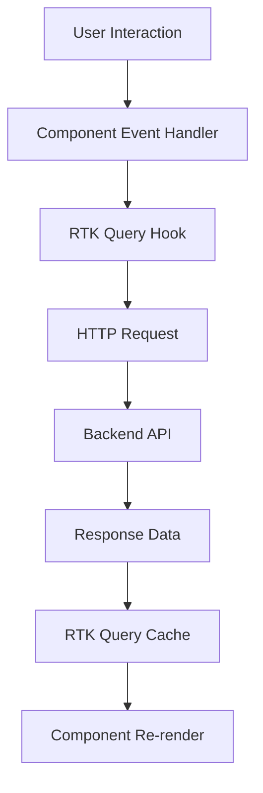
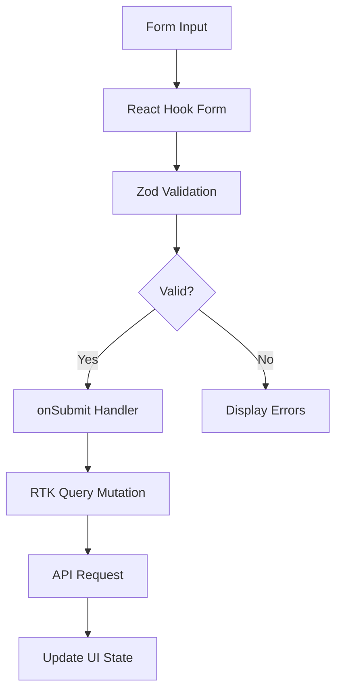

# 🏗️ RoboRally Frontend Architecture

This document provides a comprehensive overview of the RoboRally frontend system architecture, design decisions, and technology stack implementation.

## 📋 Table of Contents

- [System Overview](#-system-overview)
- [Architecture Patterns](#-architecture-patterns)
- [Technology Stack](#-technology-stack)
- [Data Flow](#-data-flow)
- [Component Architecture](#-component-architecture)
- [State Management](#-state-management)
- [Form Management](#-form-management)
- [Styling Architecture](#-styling-architecture)
- [API Integration](#-api-integration)
- [Error Handling](#-error-handling)
- [Performance Considerations](#-performance-considerations)
- [Security](#-security)

## 🎯 System Overview

RoboRally frontend is a modern, cyberpunk-themed web application built with Next.js 15 that serves as the user interface for a robot programming game. The architecture follows modern React patterns with a focus on type safety, performance, and maintaiability.

### Core Principles

- **Component-Driven Development**: Reusable, composable UI components
- **Type Safety First**: Full TypeScript implementation with strict typing
- **Performance Optimized**: Modern React patterns and Next.js optimizations
- **Accessible**: WCAG compliant components and keyboard navigation
- **Scalable**: Modular architecture that grows with the application

## 🏛️ Architecture Patterns

### 1. Feature-Based Module Architecture

```
src/
├── modules/                 # Feature modules
│   ├── auth/               # Authentication feature
│   ├── game/               # Game management
│   └── robot/              # Robot control
├── components/             # Shared components
├── lib/                   # Utilities and services
└── redux/                 # Global state management
```

**Benefits:**

- Clear separation of concerns
- Easy to locate feature-specific code
- Promotes code reusability
- Facilitates team collaboration

### 2. Layered Architecture

```
┌─────────────────────────────────────┐
│           Presentation Layer        │
│        (Pages & Components)         │
├─────────────────────────────────────┤
│           Business Logic            │
│         (Hooks & Services)          │
├─────────────────────────────────────┤
│            Data Layer               │
│        (RTK Query & Redux)          │
├─────────────────────────────────────┤
│           External APIs             │
│         (Backend Services)          │
└─────────────────────────────────────┘
```

## 💻 Technology Stack

### Core Framework: Next.js 15

**Why Next.js?**

- **App Router**: Modern routing with React Server Components
- **Automatic Code Splitting**: Optimized bundle sizes
- **Built-in Performance**: Image optimization, font loading
- **Developer Experience**: Fast Refresh, TypeScript support
- **Production Ready**: Built-in optimizations and deployment

**Implementation:**

```typescript
// app/layout.tsx - Root layout with providers
export default function RootLayout({
  children,
}: {
  children: React.ReactNode;
}) {
  return (
    <html lang="en" className="dark">
      <body className={`${tomorrow.variable} font-tomorrow antialiased`}>
        <Providers>{children}</Providers>
      </body>
    </html>
  );
}
```

### State Management: Redux Toolkit (RTK)

**Why Redux Toolkit?**

- **Simplified Redux**: Reduces boilerplate significantly
- **Built-in Best Practices**: Immer integration, DevTools
- **TypeScript Support**: Excellent type inference
- **RTK Query Integration**: Seamless data fetching

**Store Configuration:**

```typescript
// redux/store.ts
export const store = configureStore({
  reducer: {
    api: baseApi.reducer,
    // Other reducers...
  },
  middleware: (getDefaultMiddleware) =>
    getDefaultMiddleware().concat(baseApi.middleware),
});
```

**Benefits:**

- Predictable state updates
- Time-travel debugging
- Centralized application state
- Excellent DevTools integration

### Data Fetching: RTK Query

**Why RTK Query?**

- **Built on Redux Toolkit**: Seamless integration
- **Automatic Caching**: Smart cache management
- **Background Updates**: Automatic refetching
- **Optimistic Updates**: Better user experience
- **Code Generation**: Automatic hooks generation

**API Definition:**

```typescript
// redux/api/auth/authApi.ts
export const authApi = baseApi.injectEndpoints({
  endpoints: (builder) => ({
    signup: builder.mutation<SignupResponse, SignupRequest>({
      query: (credentials) => ({
        url: "/auth/signup",
        method: "POST",
        body: credentials,
      }),
      invalidatesTags: ["User"],
    }),
    login: builder.mutation<LoginResponse, LoginRequest>({
      query: (credentials) => ({
        url: "/auth/login",
        method: "POST",
        body: credentials,
      }),
      invalidatesTags: ["User"],
    }),
  }),
});
```

**Data Flow:**

1. Component dispatches RTK Query hook
2. RTK Query manages cache and loading states
3. Automatic re-renders on data changes
4. Background refetching and cache invalidation

**Advantages:**

- Eliminates manual cache management
- Reduces boilerplate for API calls
- Automatic loading and error states
- Optimized network requests

### Form Management: React Hook Form + Zod

**Why React Hook Form?**

- **Performance**: Minimal re-renders
- **Developer Experience**: Simple API
- **Validation Integration**: Works seamlessly with Zod
- **TypeScript Support**: Full type safety

**Why Zod for Validation?**

- **Runtime Safety**: Validates data at runtime
- **Type Inference**: Automatic TypeScript types
- **Composable Schemas**: Reusable validation logic
- **Error Messages**: Detailed validation feedback

**Implementation Example:**

```typescript
// Form schema definition
const formSchema = z.object({
  username: z
    .string()
    .min(2, "Username must be at least 2 characters")
    .max(100)
    .trim(),
  password: z
    .string()
    .min(4, "Password must be at least 4 characters")
    .max(100)
    .trim(),
  birthday: z.date(),
});

type FormData = z.infer<typeof formSchema>;

// Component implementation
export const Signup = () => {
  const form = useForm<FormData>({
    resolver: zodResolver(formSchema),
    defaultValues: {
      username: "",
      password: "",
      birthday: new Date(),
    },
  });

  const onSubmit = async (data: FormData) => {
    // Type-safe form submission
  };
};
```

**Form Architecture Benefits:**

- **Type Safety**: Full TypeScript integration from schema to component
- **Performance**: Only re-renders when necessary
- **Validation**: Client-side validation with server-side backup
- **Accessibility**: Proper error messaging and focus management
- **Developer Experience**: IntelliSense for form fields and validation

### Component Library: shadcn/ui

**Why shadcn/ui?**

- **Copy-Paste Architecture**: Own your components
- **Accessibility First**: WCAG compliant by default
- **Customizable**: Full control over styling
- **TypeScript Native**: Built with TypeScript
- **Modern Patterns**: Uses latest React patterns

**Component Structure:**

```typescript
// components/ui/button.tsx
interface ButtonProps extends React.ButtonHTMLAttributes<HTMLButtonElement> {
  variant?:
    | "default"
    | "destructive"
    | "outline"
    | "secondary"
    | "ghost"
    | "link";
  size?: "default" | "sm" | "lg" | "icon";
}

const Button = React.forwardRef<HTMLButtonElement, ButtonProps>(
  ({ className, variant = "default", size = "default", ...props }, ref) => {
    return (
      <button
        className={cn(buttonVariants({ variant, size, className }))}
        ref={ref}
        {...props}
      />
    );
  }
);
```

**Integration Benefits:**

- No vendor lock-in
- Full customization control
- Consistent design system
- Excellent accessibility

### Styling: Tailwind CSS v4

**Why Tailwind CSS v4?**

- **Utility-First**: Rapid development
- **Design System Integration**: Consistent spacing and colors
- **Performance**: Purged unused styles
- **Developer Experience**: IntelliSense support
- **New Features**: CSS-in-JS alternative, better theming

**Design System Implementation:**

```css
/* globals.css - Design system configuration */
@theme inline {
  /* RoboRally Custom Colors */
  --color-neon-teal: hsl(var(--neon-teal));
  --color-neon-magenta: hsl(var(--neon-magenta));
  --color-neon-blue: hsl(var(--neon-blue));
  --color-neon-lime: hsl(var(--neon-lime));

  /* Custom utilities */
  --box-shadow-glow-teal: var(--glow-teal);
  --background-image-gradient-primary: var(--gradient-primary);
}

/* Custom utility classes */
.glass-panel {
  @apply bg-surface-dark/80 backdrop-blur-md border border-chrome/30 rounded-xl;
}

.glow-teal {
  box-shadow: 0 0 20px hsl(var(--neon-teal) / 0.5);
}
```

**Styling Architecture:**

- **CSS Custom Properties**: Theme-aware design system
- **Utility Classes**: Rapid development with consistent spacing
- **Component Variants**: Reusable component styles
- **Responsive Design**: Mobile-first approach
- **Dark Mode**: Built-in dark theme support

## 🔄 Data Flow

### 1. Component to API Flow



### 2. Form Submission Flow



## 🧩 Component Architecture

### Component Hierarchy

```
App Layout
├── Providers (Redux, Toast)
├── Pages (Next.js App Router)
│   ├── Login Page
│   ├── Signup Page
│   └── Game Pages
├── Feature Modules
│   ├── Auth Components
│   ├── Game Components
│   └── Robot Components
└── UI Components (shadcn/ui)
    ├── Forms
    ├── Navigation
    └── Feedback
```

### Component Design Principles

1. **Single Responsibility**: Each component has one clear purpose
2. **Composition over Inheritance**: Build complex UIs from simple parts
3. **Props Interface**: Clear, typed interfaces for all components
4. **Accessibility**: ARIA labels, keyboard navigation, screen reader support
5. **Performance**: Memoization where appropriate, lazy loading

### Example Component Structure

```typescript
// components/ui/card.tsx
interface CardProps extends React.HTMLAttributes<HTMLDivElement> {
  variant?: "default" | "game" | "robot";
}

const Card = React.forwardRef<HTMLDivElement, CardProps>(
  ({ className, variant = "default", ...props }, ref) => {
    return (
      <div
        ref={ref}
        className={cn(cardVariants({ variant }), className)}
        {...props}
      />
    );
  }
);

// Usage in feature component
const GameCard = ({ game }: { game: Game }) => {
  return (
    <Card variant="game" className="glass-panel glow-teal">
      <CardHeader>
        <CardTitle>{game.name}</CardTitle>
      </CardHeader>
      <CardContent>{/* Game details */}</CardContent>
    </Card>
  );
};
```

## 🗃️ State Management

### Redux Store Structure

```typescript
interface RootState {
  api: {
    queries: {
      /* RTK Query cache */
    };
    mutations: {
      /* Mutation states */
    };
  };
  // Additional slices as needed
}
```

### State Management Patterns

1. **Server State**: Managed by RTK Query

   - API data caching
   - Loading and error states
   - Background synchronization

2. **Client State**: Managed by Redux slices (when needed)

   - UI state (modals, forms)
   - User preferences
   - Navigation state

3. **Component State**: Managed by React hooks
   - Local UI state
   - Form inputs
   - Component-specific logic

### RTK Query Cache Management

```typescript
// Automatic cache invalidation
const gameApi = baseApi.injectEndpoints({
  endpoints: (builder) => ({
    getGames: builder.query<Game[], void>({
      query: () => "/games",
      providesTags: ["Game"],
    }),
    updateGame: builder.mutation<Game, Partial<Game>>({
      query: ({ id, ...patch }) => ({
        url: `/games/${id}`,
        method: "PATCH",
        body: patch,
      }),
      invalidatesTags: ["Game"],
    }),
  }),
});
```

## 📝 Form Management

### Form Architecture Pattern

```typescript
// 1. Schema Definition (Type Safety + Validation)
const schema = z.object({
  field: z.string().min(1, "Required"),
});

// 2. Type Inference
type FormData = z.infer<typeof schema>;

// 3. Hook Integration
const form = useForm<FormData>({
  resolver: zodResolver(schema),
  defaultValues: { field: "" },
});

// 4. Component Integration
<FormField
  control={form.control}
  name="field"
  render={({ field }) => (
    <FormItem>
      <FormLabel>Field</FormLabel>
      <FormControl>
        <Input {...field} />
      </FormControl>
      <FormMessage />
    </FormItem>
  )}
/>;
```

### Form Validation Strategy

1. **Client-Side Validation**: Immediate feedback using Zod schemas
2. **Server-Side Validation**: Backend validation as final authority
3. **Error Handling**: Consistent error display across all forms
4. **Accessibility**: Proper error announcements and focus management

## 🎨 Styling Architecture

### Design System Hierarchy

```
Global Theme
├── Color System (Neon cyberpunk palette)
├── Typography (Tomorrow font family)
├── Spacing (Consistent scale)
├── Components (Glass morphism effects)
└── Animations (Cyberpunk transitions)
```

### Tailwind CSS v4 Features

```css
@theme inline {
  /* Direct color definitions for utility generation */
  --color-neon-teal: hsl(var(--neon-teal));

  /* Automatic utility class generation */
  /* Results in: text-neon-teal, bg-neon-teal, border-neon-teal */
}
```

### Custom Utility Classes

```css
/* Cyberpunk glass panels */
.glass-panel {
  @apply bg-surface-dark/80 backdrop-blur-md border border-chrome/30;
}

/* Neon glow effects */
.glow-teal {
  box-shadow: 0 0 20px hsl(var(--neon-teal) / 0.5);
}

/* Gaming animations */
.animate-neon-pulse {
  animation: neon-pulse 2s ease-in-out infinite;
}
```

## 🔌 API Integration

### RTK Query Implementation

```typescript
// Base API configuration
export const baseApi = createApi({
  reducerPath: "api",
  baseQuery: fetchBaseQuery({
    baseUrl: process.env.NEXT_PUBLIC_API_URL,
    prepareHeaders: (headers, { getState }) => {
      // Add authentication headers
      const token = getAuthToken(getState());
      if (token) {
        headers.set("authorization", `Bearer ${token}`);
      }
      return headers;
    },
  }),
  tagTypes: ["User", "Game", "Robot"],
  endpoints: () => ({}),
});
```

### Automatic Hook Generation

```typescript
// API definition automatically generates hooks
export const {
  useSignupMutation,
  useLoginMutation,
  useGetGamesQuery,
  useUpdateGameMutation,
} = authApi;

// Usage in components
const LoginForm = () => {
  const [login, { isLoading, error }] = useLoginMutation();
  // Component logic...
};
```

## ⚠️ Error Handling

### Comprehensive Error Handling System

```typescript
// lib/error-handler.ts
export interface BackendError {
  status: number;
  data: {
    title: string;
    status: number;
    detail: string;
  };
}

export function showErrorToast(error: any, fallbackMessage?: string) {
  const title = getErrorMessage(error);
  const detail = getErrorDetail(error);
  const status = getErrorStatus(error);

  // Gaming-themed error messages
  let gamingTitle = title;
  switch (status) {
    case 401:
      gamingTitle = "🔒 ACCESS DENIED";
      break;
    case 500:
      gamingTitle = "💥 SYSTEM MALFUNCTION";
      break;
  }

  toast.error(gamingTitle, { description: detail });
}
```

### Error Handling Strategy

1. **Type Safety**: Typed error interfaces
2. **Consistent Display**: Standardized error messaging
3. **User Experience**: Gaming-themed error messages
4. **Debugging**: Detailed error logging
5. **Recovery**: Retry mechanisms for appropriate errors

## ⚡ Performance Considerations

### Optimization Strategies

1. **Code Splitting**: Automatic route-based splitting with Next.js
2. **Component Lazy Loading**: Dynamic imports for large components
3. **Image Optimization**: Next.js automatic image optimization
4. **Bundle Analysis**: Regular bundle size monitoring
5. **Caching**: RTK Query automatic caching and background updates

### Performance Monitoring

```typescript
// Performance measurement
const performanceObserver = new PerformanceObserver((list) => {
  list.getEntries().forEach((entry) => {
    console.log(`${entry.name}: ${entry.duration}ms`);
  });
});

performanceObserver.observe({ entryTypes: ["measure", "navigation"] });
```

## 🔐 Security

### Security Measures

1. **Input Validation**: Client and server-side validation with Zod
2. **XSS Prevention**: React's built-in XSS protection
3. **CSRF Protection**: Token-based authentication
4. **Content Security Policy**: Restricted resource loading
5. **Environment Variables**: Secure API endpoint configuration

### Authentication Flow

```typescript
// Secure token storage and management
const useAuth = () => {
  const [login] = useLoginMutation();

  const handleLogin = async (credentials: LoginCredentials) => {
    try {
      const { token } = await login(credentials).unwrap();
      // Secure token storage
      localStorage.setItem("token", token);
    } catch (error) {
      showErrorToast(error);
    }
  };
};
```

## 🚀 Deployment & Production

### Build Process

```bash
# Production build
npm run build

# Build analysis
npm run analyze

# Type checking
npm run type-check
```

### Environment Configuration

```typescript
// Environment-specific configuration
const config = {
  apiUrl: process.env.NEXT_PUBLIC_API_URL,
  environment: process.env.NODE_ENV,
  version: process.env.NEXT_PUBLIC_APP_VERSION,
};
```

### Performance Metrics

- **First Contentful Paint**: < 1.5s
- **Largest Contentful Paint**: < 2.5s
- **Cumulative Layout Shift**: < 0.1
- **First Input Delay**: < 100ms
- **Bundle Size**: < 250KB (gzipped)

---

This architecture provides a solid foundation for building a scalable, maintainable, and performant RoboRally frontend application. The combination of modern React patterns, type safety, and cyberpunk aesthetics creates an engaging user experience while maintaining code quality and developer productivity.
